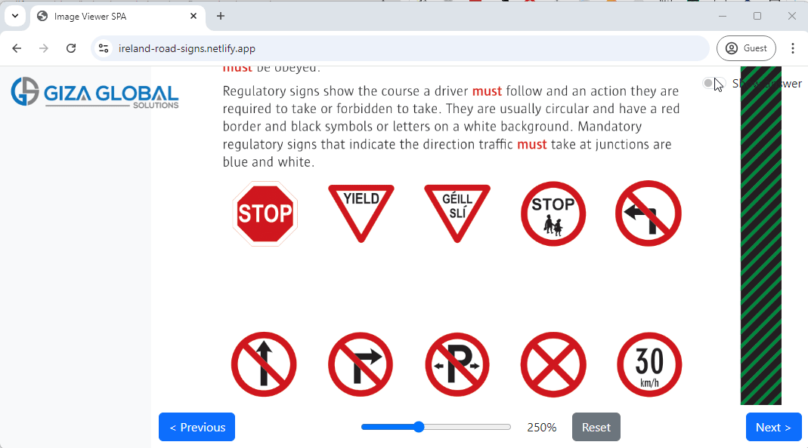

# Ireland Road Signs

A simple web app created with claude to facilitate memorizing the road signs.  

Reference: [Rules of the Road](https://www.rsa.ie/services/learner-drivers/resources/rules-of-the-road)  

Any Ireland resident trying to pass driving theory test, and/or driving test, will need to refer to this "Rules of the Road" book at some point of time.  

I have taken the section 21: Signs from last bunch of pages of this book, and created this app, where I simply hide the answers via toggle option, so readers could practice trying to answer, and if could not get it right, can simply toggle to view the answer.. 

  

